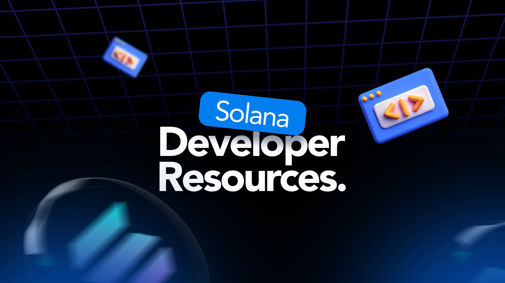

# Solana Developer Resources

A curated list of free, high-quality, on-demand resources for developers looking to learn, build, and grow within the Solana ecosystem. This repository is designed to help you understand how Solana works, access top educational content, explore the best tools, and connect with the broader community.

Whether you're just getting started or looking to deepen your expertise, you'll find helpful tutorials, documentation, dev tools, funding opportunities, job boards, and more. The goal is not to overwhelm but to give you a practical, well-organised starting point for getting cracking with Solana development.

This is not an exhaustive index of everything in the ecosystem—rather, it's a focused and evolving guide for anyone serious about building on Solana. You're also welcome to contribute to the repo if you find a useful opportunity for the community.

<figure><figcaption></figcaption></figure>

## Table of Contents

* [How Solana Works](#how-solana-works)
* [Tutorial Documentation](#tutorial-documentation)
* [YouTube Channels](#youtube-channels)
* [Free Online Course Programs](#free-online-course-programs)
* [GitHub Repositories](#github-repositories)
* [Development Tools](#development-tools)
* [Node Providers](#node-providers)
* [Security on Solana](#security-on-solana)
* [Hackathons/Grants](#hackathonsgrants)
* [Communities/DAOs](#communitiesdaos)
* [Recommended Books](#recommended-books)
* [Contributing](#contributing)

### How Solana Works

Understanding the fundamentals of Solana's architecture and consensus mechanism.&#x20;

<figure><figcaption></figcaption></figure>

* [**Solana Architecture Breakdown by Ichigo**](https://www.helius.dev/blog/solana-executive-overview) - A detailed overview of the Solana protocol
* [**Solana Whitepaper**](https://solana.com/solana-whitepaper.pdf) - The original technical paper explaining Proof of History and Solana's architecture
* [**Solana Architecture Overview**](https://docs.solana.com/cluster/overview) - Official documentation on how Solana clusters work
* [**Understanding Proof of History**](https://medium.com/solana-labs/proof-of-history-a-clock-for-blockchain-cf47a61a9274) - Deep dive into Solana's innovative consensus mechanism
* [**Solana's 8 Core Innovations**](https://medium.com/solana-labs/7-innovations-that-make-solana-the-first-web-scale-blockchain-ddc50b1defda) - Key technical innovations that enable Solana's performance
* [**Solana Validator Economics**](https://docs.solana.com/economics_overview) - How staking and rewards work on Solana

### Tutorial Documentation

Step-by-step guides and tutorials for building on Solana.&#x20;

<figure><figcaption></figcaption></figure>

* [**Solana Cookbook**](https://solanacookbook.com/) - Comprehensive collection of code examples and recipes
* [**Anchor Tutorial**](https://www.anchor-lang.com/docs/intro) - Official Anchor framework documentation and tutorials
* [**Solana Program Library Guide**](https://spl.solana.com/) - Tutorials for using Solana's standard program library
* [**Hello World on Solana**](https://github.com/solana-labs/example-helloworld) - Official beginner tutorial for your first Solana program
* [**Solana Web3.js Tutorial**](https://solanacookbook.com/guides/get-program-accounts.html) - Client-side development with Solana's JavaScript library
* [Solana Hello World](https://docs.solana.com/developing/helloworld)
* [Solana Labs Tutorials](https://docs.solana.com/developing)
* [Solana Core Concepts by Buildspace](https://buildspace.so/solana)
* [Solana Stack Exchange](https://solana.stackexchange.com/) - Solana stackoverflow
* [**QuickNode Solana Guides & Tutorials**](https://www.quicknode.com/guides/solana) - Step-by-step tutorials on various Solana development topics.
* [**Solana Developer Docs**](https://docs.solana.com/) - Main solana developer documentation
* [**Solana core docs**](https://docs.anza.xyz/) - Core Validator-Client documentation
* [**Helius Blog**](https://www.helius.dev/blog/) - Everything you need to build on solana

### Youtube Channels

Top YouTube channels for Solana development content.&#x20;

<figure><figcaption></figcaption></figure>

* [**Solana Foundation**](https://www.youtube.com/c/SolanaLabs) - Official channel with talks, tutorials, and ecosystem updates
* [**Solana Bytes**](https://www.youtube.com/playlist?list=PLilwLeBwGuK51Ji870apdb88dnBr1Xqhm) - Short-form technical content from Solana Labs
* [**Ackee Blochain**](https://www.youtube.com/@ackeeblockchain) - School of solana playlists from Ackee Blockchain Security
* [**Brimigs**](https://www.youtube.com/@brimigs) - Bri is building on Solana and chatting about Rust
* [**Helius**](https://www.youtube.com/@helius_labs) - On a mission to accelerate crypto-powered software for builders
* [**Quicknode**](https://www.youtube.com/watch?v=B5eBWWQfQuM\&list=PLT2H_0otcvBSTJKr6DHqyTzrqtgWHcOTH) -Learn how to build on solana with Mike Macana

### Free Online Course Programs

Structured learning programs for Solana development.&#x20;

<figure><figcaption></figcaption></figure>

* [**Solana Foundation Developer Program**](https://solana.com/developers) - Everything solana development from solana foundation engineers
* [**Solana Foundation Developer Bootcamp**](https://www.youtube.com/watch?v=amAq-WHAFs8\&list=PLilwLeBwGuK7HN8ZnXpGAD9q6i4syhnVc) - Full self paced solana developer bootcamp
* [**Turbin3, The Solana Talent Engine**](https://turbin3.org/) - Quarterly detailed program for core solana development
* [**Ackee Blockchain**](https://ackee.xyz/school-of-solana) - Ackee Blockchain School of Solana
* [**Solana Core Developer Program**](https://www.soldev.app/course) - Comprehensive free course covering Solana fundamentals to advanced topics
* [**Buildspace Solana Course**](https://buildspace.so/builds/solana-web3-app) - Project-based learning for building full-stack Solana applications
* [**Questbook Solana Course**](https://openquest.xyz/tracks/build-on-solana) - Interactive learning path with hands-on exercises
* [**Solana Summer Camp**](https://www.soldev.app/library) - Seasonal intensive programs for aspiring Solana developers
* [**Alchemy University Solana Track**](https://university.alchemy.com/) - University-style curriculum for blockchain development including Solana

### Github Repositories

Essential GitHub repositories for Solana development.&#x20;

<figure><figcaption></figcaption></figure>

* [**solana-labs/solana**](https://github.com/solana-labs/solana) - Main Solana blockchain implementation
* [**coral-xyz/anchor**](https://github.com/coral-xyz/anchor) - Anchor framework for Solana smart contracts
* [**solana-labs/solana-program-library**](https://github.com/solana-labs/solana-program-library) - Collection of standard Solana programs
* [**solana-developers/program-examples**](https://github.com/solana-developers/program-examples) - Collection of example programs and dApps
* [**Andrea**](https://github.com/ASCorreia) - one of the most cracked guy building on solana
* [**Turbin3 Developer Program**](https://github.com/solana-turbin3) - public repo for turbin3 cohorts
* [**Quicknode Solana Tutorials**](http://github.com/quiknode-labs?q=solana\&type=all\&language=\&sort=) - quicknode solana integration repos
* [**Ackee Blockchain School of Solana**](https://github.com/ackee-blockchain) -Hands-on everything on Solana and Solana security
* [**MagicBlock**](https://github.com/magicblock-labs) - MagicBlock ephemeral rollup integration and SDK examples

### Development Tools

Tools and frameworks for building on Solana.&#x20;

<figure><figcaption></figcaption></figure>

#### Infrastructure and APIs

| Tool                                                                                                                               | Description                                                                                                                                               |
| ---------------------------------------------------------------------------------------------------------------------------------- | --------------------------------------------------------------------------------------------------------------------------------------------------------- |
| **Core Development**                                                                                                               |                                                                                                                                                           |
| [Solana CLI](https://docs.solana.com/cli)                                                                                          | Command-line interface for interacting with Solana networks                                                                                               |
| [Anchor Framework](https://www.anchor-lang.com/)                                                                                   | Rust framework for building Solana programs with IDL generation                                                                                           |
| [Solana Program Library (SPL)](https://github.com/solana-labs/solana-program-library)                                              | Collection of on-chain programs for common use cases                                                                                                      |
| [Solana Web3.js](https://solana-labs.github.io/solana-web3.js/)                                                                    | JavaScript SDK for building client-side applications                                                                                                      |
| [Solana Playground](https://beta.solpg.io/)                                                                                        | Browser-based IDE for writing and testing Solana programs                                                                                                 |
| **IDEs & Development Environments**                                                                                                |                                                                                                                                                           |
| [Solana Playground](https://beta.solpg.io/)                                                                                        | Web-based development environment                                                                                                                         |
| [Seahorse](https://www.seahorse.dev/)                                                                                              | Python framework for writing Solana programs                                                                                                              |
| [Neon Labs](https://www.neonevm.org/)                                                                                              | Ethereum Virtual Machine on Solana for Solidity developers                                                                                                |
|                                                     |
| **Wallet Integration**                                                                                                             |                                                                                                                                                           |
| [Phantom Wallet SDK](https://docs.phantom.com/)                                                                                    | SDK for integrating with Phantom wallet                                                                                                                   |
| [Solflare Wallet SDK](https://docs.solflare.com/solflare/technical/integrate-solflare/solflare-wallet-sdk)                         | SDK for integrating with Solflare wallet                                                                                                                  |
| [Solana Wallet Adapter](https://github.com/solana-labs/wallet-adapter)                                                             | Standardized wallet connection library                                                                                                                    |
| **Infrastructure & APIs**                                                                                                          |                                                                                                                                                           |
| RPC Providers                                                                                                                      | Services like [Alchemy](https://www.alchemy.com/solana), [QuickNode](https://www.quicknode.com/),[Helius](https://helius.dev/) for blockchain data access |
| [Metaplex SDK](https://github.com/metaplex-foundation/js)                                                                          | NFT and digital asset infrastructure                                                                                                                      |
| [Jupiter Aggregator](https://github.com/jup-ag/jupiter-core-example)                                                               | Swap aggregation protocol                                                                                                                                 |
| [MagicBlock](https://docs.magicblock.gg/pages/get-started/introduction/why-magicblock?utm_source=website-footer\&utm_content=Docs) | The high-performance engine for real-time applications on Solana                                                                                          |
| **Deployment & Monitoring**                                                                                                        |                                                                                                                                                           |
| [Solana Beach](https://solanabeach.io/)                                                                                            | Network statistics and validator information                                                                                                              |
| [Solscan](https://solscan.io/)                                                                                                     | Block explorer and analytics                                                                                                                              |
| [Solana Explorer](https://explorer.solana.com/)                                                                                    | Inspect transactions, accounts, blocks, and more on the Solana blockchain.                                                                                |

### Node Providers

RPC node providers are used to connect to the Solana network.&#x20;

<figure><figcaption></figcaption></figure>

* [**Helius**](https://helius.xyz/) - Developer-focused Solana RPC with additional tooling
* [**QuickNode**](https://www.quicknode.com/chains/sol) - High-performance Solana RPC endpoints
* [**Solana Public RPC**](https://docs.solana.com/cluster/rpc-endpoints) - Official public RPC endpoints (rate limited)
* [**Alchemy**](https://www.alchemy.com/solana) - Enterprise-grade Solana RPC with enhanced APIs
* [**GenesysGo**](https://genesysgo.com/) - Solana RPC provider with global infrastructure

### Security on Solana

Security organisations and communities, best practices, and resources for Solana.&#x20;

<figure><figcaption></figcaption></figure>

#### Security Courses

* [Ackee Blockchain Solana Auditors Bootcamp](https://ackee.xyz/solana-auditors-bootcamp)
* [Ackee Blockchain Solana Auditors Bootcamp 2024](https://www.youtube.com/watch?v=yYWqKRz82Pw\&list=PLzUrW5H8-hDdU-pzHjZrgupi5Wis6zWNJ)
* [Rektoff– Rust-native security training for engineers, enterprises, and ecosystems](https://www.rektoff.xyz/)

### Hackathons/Grants

Major funding opportunities and competitions for Solana builders.&#x20;

<figure><figcaption></figcaption></figure>

* [Colosseum](https://www.colosseum.com/) - The world's most competitive online hackathons, where elite crypto builders launch startups on Solana
* [Colosseum Accelerator](https://www.colosseum.com/accelerator/) - For crypto founders to become embedded in the Solana ecosystem
* [Solana Foundation Grants](https://solana.org/grants-funding) - Different grant and funding opportunities within the Solana ecosystem
* [Superteam Grants](https://earn.superteam.fun/grants/) - Quick microgrants (<$10k) to early-stage products
* [MonkeyDAO Grants](https://form.typeform.com/to/LTPmMZJm?typeform-source=t.co) - Funding and marketing support for Solana projects catering to everyday users
* [Island DAO Grants](https://li4rhd691jg.typeform.com/to/DOPVAt16) - For Solana projects innovating in governance tools, security, tokenisation, and more.

### Communities/DAOs

Active Solana communities for learning and networking.&#x20;

<figure><figcaption></figcaption></figure>

* [Superteam](https://superteam.fun/) - This is the best talent pipeline for learning, earning and building in crypto, available in your country
* [Solana Devs](https://x.com/solana_devs) - News, updates, content, code and job opportunities for Solana developers

### Recommended Books
_Coming soon - curated list of essential books for Solana development and blockchain understanding._

### Landing Solana ecosystem Jobs
Land Solana ecosystem jobs with these platforms
<figure><figcaption></figcaption></figure>

-  [Solana Job Board](https://jobs.solana.com/)
-  [Superteam Talent](https://talent.superteam.fun/)
-  [Solana Job Playbook](https://talent.superteam.fun/playbook)

## You Wanna Contribute

Found a great resource that's missing? Please contribute by:

1. Forking this repository
2. Adding your resource in the appropriate section
3. Following the existing format: **Title** - Brief description
4. Submitting a pull request

## Share some love ⭐

If you find this repository helpful, please consider giving it a star ⭐
